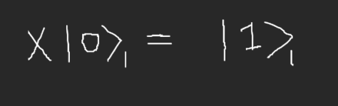

# Auto Bell-State Generator

## Contents

- [Problem Statement](#problem-statement)
- [Instructions to Run Program](#instructions-to-run-program)
- [Circuit Design](#circuit-design)
- [Ideal quantum circuit](#ideal-quantum-circuit)
- [Design Partitions](#design-partitions)
- [Cirquit and Parameter Initialization](#circuit-and-parameter-initialization)
- [Cost Function](#cost-function)
- [Mean Squared Error](#mean-squared-error)
- [Optimizers](#optimizers)
  - [Gradient Descent](#gradient-descent)
  - [Nesterov Accelerated Gradient](#nesterov-accelerated-gradient)
- [Results and Comparison](#results-and-comparison)
- [Bonus Question](#bonus-question)
- [Conclusion and Future Scope](#conclusion-and-future-scope)

---

## Problem Statement ##
Implement a circuit that returns |01> and |10> with equal probability.  
**Requirements for the task**  
- The circuit should consist only of CNOTs, RXs and RYs. 
- Start from all parameters in parametric gates being equal to 0 or randomly chosen. 
- You should find the right set of parameters using gradient descent (you can use more advanced optimization methods if you like). 
- Simulations must be done with sampling - i.e. a limited number of measurements per iteration and noise. 
- Compare the results for different numbers of measurements: 1, 10, 100, 1000.

**Requirements met**  
- Ideal circuit involves just one RY and CNOT gate each. :D 
- Code has parameters, 'shots' and 'angle', initially being equal to 0 or randomly chosen. 
- Ideal values of parameter 'angle' obtained using both Gradient descent and Nesterov Accelerated Gradient, followed by a performance comparison.  
- Results of the optimizer have been compared for four different amounts of measurements: 1, 10, 100, 1000.

---
## Instructions to Run Program ##
1. Install `qiskit`
2. Clone repository and execute python file `QOSF_Task2.ipynb`

## Circuit Design ##
- Ideal state
    
    
- The state can be obtained by first applying `Hadamard` and `X` gates to q0 and q1
    
    
    
    
- And then applying `CNOT` (0 -> 1) gate to the two-qubit system.

    
    
    

## Ideal quantum circuit
- The ideal circuit can then be consolidated as follows
    
    

## Design Partitions
- The problem statement can be approached with a Hybrid Classical-Quantum optimization model, having three major partitions. 
  1. The `Bell State Generator` instantiates a quantum circuit required for the state generation, but with one optimizable parameter `angle`. It is a Quantum circuit.
  2. `Cost Function` calculates the cost or error for the parameter value of current iteration.It is a classical calculation.
  3. `Optimizer`, is a classical machine learning optimizer, updates the values of parameter `angle` for better performance of the circuit. Two classical optimizers namely - 'gradient descent' and 'Nesterov Accelerated Gradient' have been used and compared.

     
  
---
## Cirquit and Parameter Initialization ##
1. Qubit 0 is initialized to state [1,0], and Qubit 1 to [0,1] to be able to reach the aforementioned Bell State.
2. Parameter `angle` which is the angle by which the paraterized gate will rotate.
3. The angle is converted to `radians` from `degrees`and given a random initial value.
---
## Cost Function ##
### Mean Squared Error 
- The Cost function is a simple MSE function that can be used with the first order derivative optimizers like Gradient Descent very easily.
- The cost function is the squared difference of the Probability averages of both states `|01>` and `|10>`, that are obtained after the circuit is executed for a given number of `shots`.   
    
    
---
## Optimizers ##
### Gradient Descent
- The Gradient Descent Optimizer is used as it simplifies the process of convergence when our loss function is quadratic in nature.
- The local and global minimas are same things with same depths and the `loss landscape` can be easily analysed with much less compute power, and good accuracy.
- The parameter `angle` is being learned, using Gradient Descent and alpha is the `learning_rate`.  

     

### Nesterov Accelerated Gradient

- If the momentum is too high the algorithm may miss the local minima and may continue to rise up. So, to resolve this issue the `NAG algorithm` is used.
- We know we’ll be using `γV(t−1)` for modifying the weights so, `θ−γV(t−1)` approximately tells us the future location. 
     
     
---
## Results and Comparison ##
- The results are taken for measurements 1, 10, 100 and 1000 respectively.
- The optimized value of `angle` over a range of 1000 iterations of given number of shots have been calculated.
- Expected output: 90 degrees or a multiple of 90 degrees 

### 1. Gradient Descent
- The error of measurement reaches a max of 1.05% among all cases as seen.

     

### 1. Nesterov Accelerated Gradient
- The error of measurement reaches a max of 1.34% among all cases.

     
---
## Bonus Question ##
How to make sure you produce state `|01> + |10>` and not `|01> - |10>` ?

- To prevent the occurrence of phase inverse of the required state i.e. `|01> - |10>`, we will have to alter our cost function to be unsymmetrical. To alter the Mean Sqared error, we can remove the squares and keep the function linear.
- Normalising the cost function to a scale of `-1 to 1` with optimum at `0` along with a linear cost function.
---
## Conclusion and Future Scope ##
- Use of the concept of `momentum` with `NAG(Nesterov Accelerated Gradient)` did not help up achieve a better accuracy and using gradient descent is equally efficient for this problem statement.
- `Hessian` based analysis of the Linear Loss Landscapes may give us a better intuition for getting better accuracies and preventing optimization of the `|01> - |10>` state.

